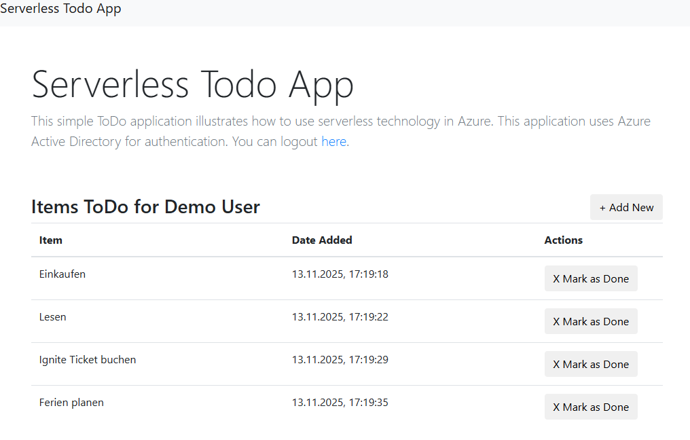

# A serverless app representing an easy ToDo List
This sample demonstrates a single page application (SPA) hosted on Azure Storage, with an api backend built using Azure Functions. The app makes use of CosmosDB to store data and Azure storage for the static content.  

The application is an easy Todo list where one user (Demo User) can add items "todo". The items are stored in a single CosmosDB document collection.

The SPA makes use of Bootstrap for styles, Knockout.js for data binding, and JQuery for ajax calls. 

Users can add new items to their list, or mark existing items as complete (which deletes them). The inital call to the API pulls the current list of items for the user, along with the user's display name (from the auth claims). 

## Setup steps on Azure

1. Create a new Azure Functions app

2. Create a CosmosDB account

3. Create a new document collection called 'TodoItems' in a new database called 'ServerlessTodo' and set the Partition Key to '/ItemOwner'. You can do this by using the Data Explorer blade and clicking 'New Container'

4. Copy the connetion string for the CosmosDB account (found in the Keys tab) and paste it into a new application setting in the function app called 'CosmosDBConnectionString' (this is found in the Configuration settings of the Function App Settings - remember to click 'Save').

5. Update the remoteUrl locations in **_vars.js_** to point to the functions endpoint

6. In the storage account for the functions app, upload the static content into a new blob container and mark the container as Public Access Level - Blob. 

7. Publish the function code to the Functions App in Azure (e.g. using Visual Studio)

8. Navigate to the site using the storage location of index.html on the storage account.
